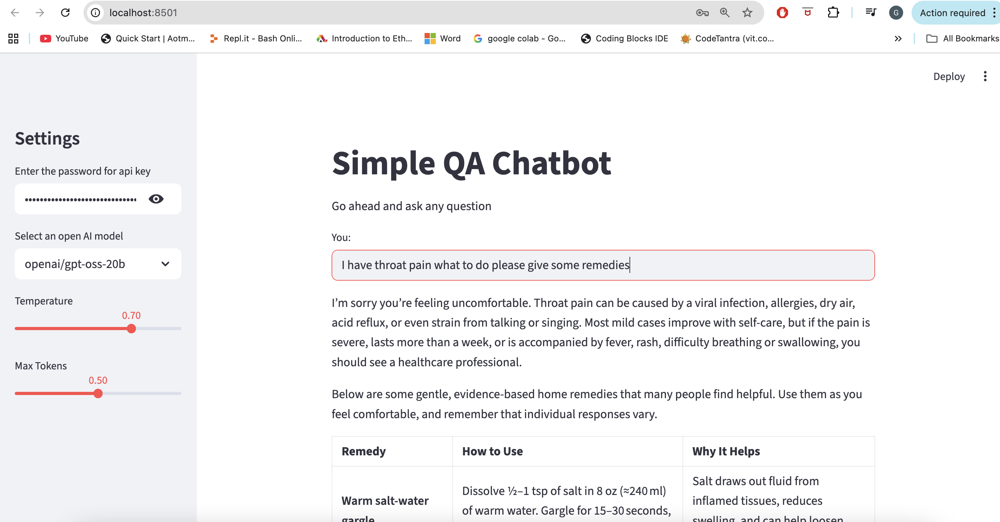

# Simple QA Chatbot (LangChain + Groq + Streamlit)

A simple and interactive **Question–Answer Chatbot** built using:

- **LangChain**
- **Groq API** (`langchain_groq`)
- **Streamlit** for the frontend UI

This chatbot allows users to input any question, configure model parameters, and view responses instantly.

---

## 📸 Application UI

Below is the UI output of the app:

---

## 🚀 Features

- Clean, user-friendly **Streamlit UI**
- Uses **Groq LLM models** for fast inference
- Sidebar with customizable options:
  - API Key input (secure)
  - Model selection
  - Temperature slider
  - Max Tokens slider
- Simple and modular Python code structure

---

